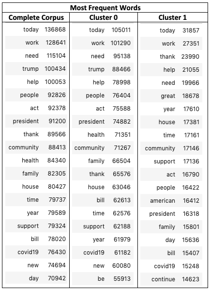

# Capstone Project: 

## 116th Congress Members Twitter Data: Identifying Groupings using Unsupervised Learning

## Problem Statement

*It's a well known fact that the United States of America has two major political parties: Republican and Democrat. While there may be a few Independents here and there, the USA political system is governed by these two major parties. But, while Congress persons affiliate with one of these two political parties, do their tweet data say otherwise? Specifically, does a congress persons archive of tweets group them differently to just Republican or Democrat? Based on the language used in an archive of tweets, do they group along lines that are not simply Republican or Democrat?**

## Background and Executive Summary

Tweet data for all active members of the 116th Congress were collected and collated into one documuent for each individual. Several unsupervised learning models were employed to see whether the text data could be used to create unique groupings that, perhaps, differ from the traditional two party system of Republican and Democrat.

### Data

This project employs data scraped from the [*Tweets of Congress*](https://github.com/alexlitel/congresstweets) GitHub which collects daily tweets for all members of Congress and affiliates. Tweets of interest were for members of the [*116th Congress*](https://en.wikipedia.org/wiki/116th_United_States_Congress) only which was in session from January 3, 2019 to January 3, 2021. Twitter handles for these Congress persons were also [*collected*](https://www.sbh4all.org/wp-content/uploads/2019/04/116th-Congress-Twitter-Handles.pdf) and merged onto the tweet data.  

In total, about 1,115,004 unique tweets were used for this project. 

#### Cleaning

Tweets of Congress, from where this data was collected, is "...the front-end portion of a project collecting the daily tweets of both houses of Congress, encompassing 1,000+ campaign, office, committee and party accounts" [*Source*](https://github.com/alexlitel/congresstweets). This project did not require tweets from any twitter accounts beyond members of both houses of Congress including campaign, office and committee accounts, therefore, the original number of 1,882,106 tweets was reduced to 1,115,004 tweets after following the steps below and only including tweets from official accounts of all Senators and Representatives serving during the 116th session of congress (January 3, 2019 to January 3, 2021). 

During examination of the data, cleaning and restructuring was necessary for analyses. Such steps included:   

- Removal of duplicates
- Keep only certain relevant columns
    - Columns kept for further processing included: 'screen_name' or the twitter handle of the user and 'text' or the content of a particular tweet. 
    
In order to keep tweets of only elected members of the 116th Congress, demographic information including Twitter handles were collected along with position (Senator or Representative). To this data, the full name, state of representation, and political party affiliation was manually added to the dataset. It is important to note, however, that not all members of Congress had Twitter accounts and so are not represented in the data. 

Once all elected and active Senators and Representatives were accounted for, the demographic information was merged with the tweet data to produce a the final dataframe including only members of the 116th Congress. 

#### Exploratory Data Analyses

Prior to unsupervised machine learning model building, high-level snapshots of the data were taken. This was done to inform understandings of the text and classes in the dataset. Also, and perhaps most importantly, it was conducted to observe any further cleaning needed.

Below are two bar graphs showing the proportion of tweets that belonged to a Senator or a Representative and the proportion belong to a specific political party. Additionally, the most prolific tweeters can be found in the third bar graph.

  
   

  

Below is an image of the most frequent words before a stop words list was implemented.  Because of this, it was deemed necessary to remove these stop words as they did not appear to add to the following analyses.  After removal of custom stopwords - completed via a modified list curated from that found built into sklearn, most frequent words in the dataframe included things like workout, body, training, day, and weight.

#### Analyses

#### Results

## Data Dictionary

## Conclusions

## Recommendations

## Sources

- https://github.com/alexlitel/congresstweets
- https://www.sbh4all.org/wp-content/uploads/2019/04/116th-Congress-Twitter-Handles.pdf
- https://en.wikipedia.org/wiki/116th_United_States_Congress
- https://textblob.readthedocs.io/en/dev/quickstart.html#sentiment-analysis
- https://github.com/cjhutto/vaderSentiment
- 
- 
- 