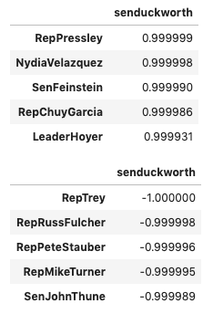

# Capstone Project: 

## 116th Congress Members Twitter Data: Identifying Groupings using Unsupervised Learning

## Problem Statement

*It's a well known fact that the United States of America has two major political parties: Republican and Democrat. While there may be a few Independents here and there, the USA political system is governed by these two major parties. But, while Congress persons affiliate with one of these two political parties, do their tweet data say otherwise? Specifically, does a congress persons archive of tweets group them differently to just Republican or Democrat? Based on the language used in an archive of tweets, do they group along lines that are not simply Republican or Democrat?**

## Background and Executive Summary

Tweet data for all active members of the 116th Congress were collected and collated into one documuent for each individual. Several unsupervised learning models were employed to see whether the text data could be used to create unique groupings that, perhaps, differ from the traditional two party system of Republican and Democrat.

## Data Collection

Data were collected from three main sources:

- [*Tweets of Congress*](https://github.com/alexlitel/congresstweets)
    - A GitHub repository which collects daily tweets for all members of Congress and affiliates and is "...the front-end portion of a project collecting the daily tweets of both houses of Congress, encompassing 1,000+ campaign, office, committee and party accounts" [*Source*](https://github.com/alexlitel/congresstweets).
- [*Twitter Handles*](https://www.sbh4all.org/wp-content/uploads/2019/04/116th-Congress-Twitter-Handles.pdf)
    - A comprehensive list of twitter handles and position (Senator, Representative) for members of the 116th Congress.
- [*Wikipedia*](https://en.wikipedia.org/wiki/116th_United_States_Congress)
    - To obtain dates and demographic information for members of the 116th Congress (full name, party affiliation, state represented)
    
First, I scraped data from the [*Tweets of Congress*](https://github.com/alexlitel/congresstweets) GitHub for all days during which the 116th Congress was in session (January 3, 2019 to January 3, 2021). As earlier noted, Tweets of Congress collects tweets beyond that of elected officials including committee, party specific accounts and campaigning accounts. This project did not require tweets from any twitter accounts beyond members of both houses of Congress and so any accounts that were not the official Twitter accounts of elected Senators and Representatives serving during the 116th session of Congress. This resulted in a total of 1,115,004 tweets - reduced from the orginally scraped amount of 1,882,106 tweets.

Second, Twitter handles were collected from [*sbh4all.org*](https://www.sbh4all.org/wp-content/uploads/2019/04/116th-Congress-Twitter-Handles.pdf). This data was manually edited into a .csv datafile and labeled with the position of the elected official (Senator, Representative). This data was then supplemented with demographic information (full name, state of representation, political party affiliation) from [*Wikipedia's*](https://en.wikipedia.org/wiki/116th_United_States_Congress) page describing the 116th Congress and its members.

#### Cleaning

During the initial examination of the data, cleaning and restructuring was necessary prior to further processing and analyses. Such steps included:   

- Removal of duplicates
- Keep only certain relevant columns
    - Columns kept for further processing included: 'screen_name' or the twitter handle of the user and 'text' or the content of a particular tweet. 
    
In order to keep tweets of only elected members of the 116th Congress, demographic information including Twitter handles were collected along with position (Senator or Representative). To this data, the full name, state of representation, and political party affiliation was manually added to the dataset. It is important to note, however, that not all members of Congress had Twitter accounts and so are not represented in the data. 

Once all elected and active Senators and Representatives were accounted for, the demographic information was merged with the tweet data to produce a the final dataframe including only members of the 116th Congress. Finally, all tweets for each individual Senator or Representative were concatinated into a single document. This resulted in 521 total documents within the corpus.

#### Initial Exploratory Data Analyses

Prior to unsupervised machine learning model building, high-level snapshots of the data were taken. This was done to inform understandings of the text and classes in the dataset. Also, and perhaps most importantly, it was conducted to observe any further cleaning needed.

Below are two bar graphs showing the proportion of tweets that belonged to a Senator or a Representative and the proportion belong to a specific political party. Additionally, the most prolific tweeters can be found in the third bar graph.

 

## Data Processing

As this is a text centered project, several specialized Python packages were used to further refine the dataframe:

- [*spaCy*](https://spacy.io/)
    - Used for the majority of text pre-processing including stop word removal, processing text contractions, text vectorization and embeddings, identifying important parts of speech (nouns, pronouns, verbs, adverbs, adjectives), and lemmatization of the text.
- [*Regex*](https://docs.python.org/3/library/re.html)
    - To remove hyperlinks, emojis, twitter handles, and other special characters
- [*TextBlob*](https://textblob.readthedocs.io/en/dev/)
    - Used for Sentiment Analysis
- [*scikit-learn*](https://scikit-learn.org/stable/)
    - Multiple packages used including CountVectorizer, TfidfVectorizer, K-Means, DBSCAN, PCA, t-SNE

After the data was compiled into a final dataframe, further processing could happen using the bulleted libraries noted above. Each Congress Person's text document containing all tweets during the period of interest was first cleaned of hyperlinks, emojis and other special characters. 

Subsequently, spaCy did the remainder of text processing by:

- Removing stopwords or the most common words that are typically filtered out when conducting NLP projects. Examples include 'and', 'was', and 'had'.
- Removing contractions to retain the root of the word. Contractions examples include 'n’t', '‘re', '’ve', '’s', '‘ll'.
- Retain only important parts of speech such as nouns, pronous, verbs, adverbs, and adjectives.
- Lemmatization which finds the root of a word. As an example, 'cats' would be lemmatized to 'cat' and 'am', 'are', and 'is' would be lemmatized to 'be'.
- Vectorization or creation of 'word embeddings'. These are vectors of numbers that describe the meaning and context of a word. Each vector has 300 dimensions only.
    - Of note, en_core_web_lg must be used as it is the only model which contains spaCy's built-in vectors.

## Data Modeling

K-Means and DBSCAN, both unsupervised learning models, were used in the search for a model providing good clustering. Each was tested with spaCy word vectors, CVEC or Count Vectorizer, and TF-IDF or term frequency–inverse document frequency; un-scaled and scaled; PCA or Principal Component Analysis; and t-SNE or t-distributed Stochastic Neighbor Embedding. DBSCAN performed poorly across the board and so will not be discussed further. K-Means produced a range of models with spaCy word vectors, CVEC, and TF-IDF performing well. 

To judge the performance of the model, two primary measures were used:
- Silhouette Score
    - Ranges from -1 to 1 where a score closer to 1 indicates greater separation from the neighboring cluster.  
- Inertia Value
    - This value is "...the sum of squared distances of data points to their closest cluster center (centroid). Lower the distance better the compactness of the clusters." [*source*](https://towardsdatascience.com/unsupervised-learning-techniques-using-python-k-means-and-silhouette-score-for-clustering-d6dd1f30b660)

Based on these values, three models were selected for further examination.

Model 1: 
- used spaCy word vectors or vectors of numbers that describe the meaning and context of a word. 
- It also used t-Distributed Stochastic Neighbor Embedding (t-SNE) which is a measure used to reduce dimensionality and works especially good on data with non-linear relationships.

Model 2:
- used CVEC which, like spaCy, creates vectors. However, CVEC, creates a vector from counting how often a word appears in each row or document. 
- Scaled or normalizing data to fit on a common scale.
- PCA or principal component analysis which is a common method to reduce data dimensionality.
- t-SNE (described above). Offical [*t-SNE documentation*](https://scikit-learn.org/stable/modules/generated/sklearn.manifold.TSNE.html?highlight=t%20sne#sklearn.manifold.TSNE) suggests applying PCA prior to applying t-SNE.

Model 3:
- used TF-IDF which creates a vector for each document or row and, instead of counting how often a word appears, it calculates the weight of each word based on how often it appears in the entire corpus.
- Scaled (described above)
- t-SNE (described above)

Based on the silhouette scores and inertia values, the final model selected was Model 2 or the CVEC model with scaled data, PCA, and t-SNE.

## Analyses

Once the final model had been determined, analysis of these clusters was undertaken. The final model had two clusters: Cluster 0 with 278 rows or documents and the slightly smaller Cluster 1 with 243 rows.

Also, the most frequently occuring words are below and include 'today', 'work', 'need', 'Trump', and 'help'.

#### Sentiment Analyses

Using [*TextBlob*](https://textblob.readthedocs.io/en/dev/quickstart.html#sentiment-analysis), a Sentiment Analysis for each cluster was undertaken. The TextBlob Sentiment Analysis produces a score between -1 and 1 where -1 is highly negative, 0 is neutral, and 1 is positive. Based on the graphs below, Cluster 0 has a slightly lower sentiment score and smaller spread of values. On the flip side, Cluster 1 has a greater spread and slightly higher sentiment average. 

 

#### Cluster Demographics

Number of tweets were binned into five equally sized gropus. Cluster 0 had the most active tweeters with 100 percent of those recording 2659 tweets or more found in this cluster.  Around 63 percent of those logging 2659 tweets or less were in Cluster 1.

 

The graph below shows that an approximately equal number of Representatives are found in both clusters. Senators, however, were found more often in Cluster 0 with around 66 percent found in Cluster 0 and 33 percent found in Cluster 1.

About 74 percent of Democrats were in Cluster 0 (26 percent in Cluster 1). More Republicans were found in Cluster 1 - 70 percent versus 30 percent in Cluster 0.

#### Similarity

Lastly, a simple program was written in a Jupyter Lab notebook that allows a user to input the Twitter handle of a Senator or Representative of the 116th Congress and receive the five most similar Senators or Representatives based on the cosine similarity of the selected Twitter account and all other accounts. Cosine similarity, for this project, ranges from -1 to 1 with at or near 1 indicating a high level of similarity and scores at or near -1 indicating a highly dissimilar set of documents. This value is calculated as the cosine of the angle degrees between two word vectors. 

Using state of Illinois Senator Tammy Duckworth as an example, below is a list of the five most similar and five least similar Twitter accounts of fellow Congress Persons.

## Recommendations and Next Steps
- Collect more official Senator and Representative Twitter data.
- Explore other dimensionality reduction measures.
- Use other word vectorization packages.
    - Gensim, GloVe
    
## Sources

- https://github.com/alexlitel/congresstweets
- https://www.sbh4all.org/wp-content/uploads/2019/04/116th-Congress-Twitter-Handles.pdf
- https://en.wikipedia.org/wiki/116th_United_States_Congress
- https://textblob.readthedocs.io/en/dev/quickstart.html#sentiment-analysis
- https://spacy.io/
- https://scikit-learn.org/stable/
- https://textblob.readthedocs.io/en/dev/
- https://docs.python.org/3/library/re.html
- https://towardsdatascience.com/unsupervised-learning-techniques-using-python-k-means-and-silhouette-score-for-clustering-d6dd1f30b660
- https://scikit-learn.org/stable/modules/generated/sklearn.manifold.TSNE.html?highlight=t%20sne#sklearn.manifold.TSNE 